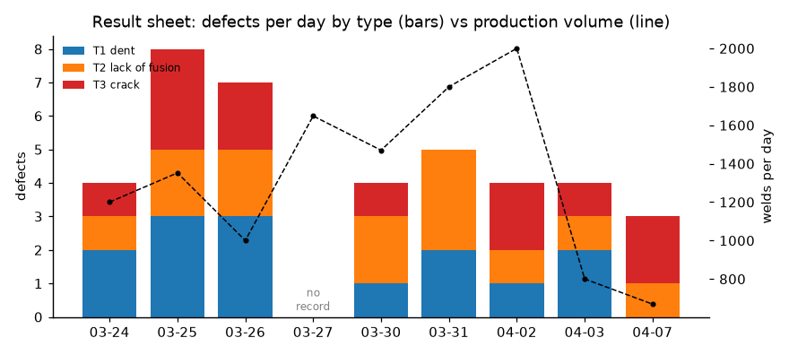
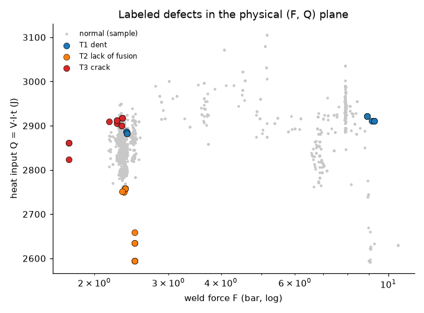
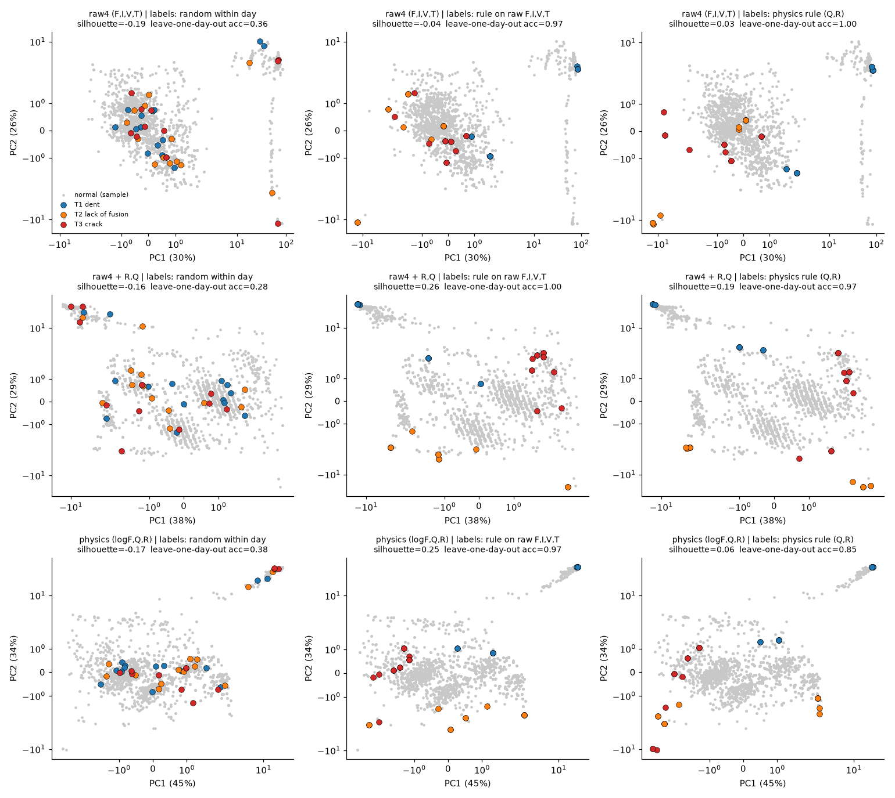
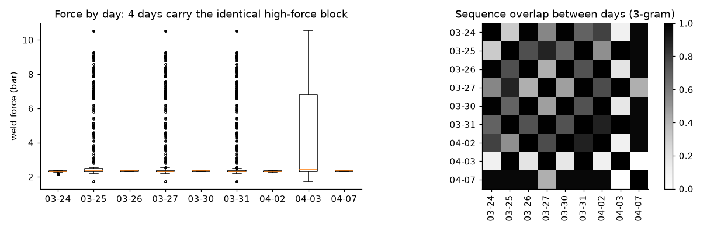
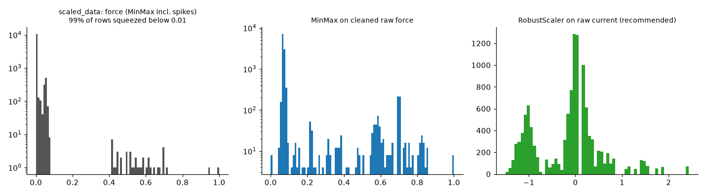
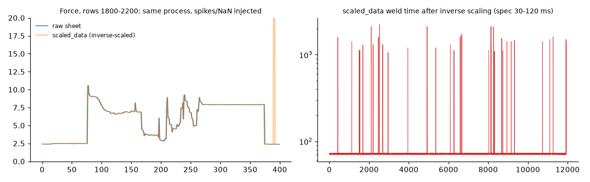

# 스폿용접 Defect 라벨 구성 및 분석 보고서

> 후속 작업: 비지도(1단계) → 지도(2단계) 불량 선별 파이프라인과 그 물리/계산 방법은 [METHODS.md](METHODS.md) 참고.

- 대상: `Welding_Data_Set_01.xlsx` (Spot-01, 품번 65235-25800, 2020-03-24 ~ 04-07, 11,939타점), `scaled_data.csv`
- 재현: `pip install pandas scikit-learn matplotlib openpyxl scipy` → `python analysis/build_defect.py`
- 산출물: `output/Defect.csv`(필수 과제), `output/fig*.png`, `output/metrics.txt`(본문 수치의 원출처)

---

## 0. 요약

| 질문 | 결론 |
|---|---|
| Defect.csv | 11,939행 전체에 `defect`(0/1), `defect type`(0 정상, 1 파임불량, 2 용접부족, 3 크랙발생)을 부여함. 다시 날짜별로 집계하면 `result` 시트 값과 정확히 일치함. 03-27은 검사 기록이 없어 빈칸으로 둠 |
| defect type 선정 | `result`에는 **날짜별 개수만** 있고 어느 타점인지는 없음. 그래서 용접 물리(주울열 Q = I²Rt)로 타입별 점수를 정의하고, 날짜마다 k개를 뽑는 **할당 문제**로 풀었음 |
| 3개 타입 구성 | 1 파임불량 14건, 2 용접부족 13건, 3 크랙 12건, 총 39건. 불량률은 0.2~0.7%/일로, 극단적인 클래스 불균형 |
| 깔끔한 분류 조건 | (1) 날짜만으로 라벨을 붙이면 PCA상 완전히 섞임(silhouette −0.19). (2) 가압력 이상 구간을 분리해서 스케일링하고, (3) 물리 기반 라벨 + R·Q를 추가하면 세 타입이 서로 다른 영역으로 갈라짐(silhouette 0.19) |
| 날짜 영향 | 날짜는 **피처로 쓰면 안 됨**. 여러 날짜의 데이터가 사실상 서로의 복사본이고(3-gram 중복 ≈1.0), 불량 수와 생산량의 상관은 0.09에 불과함. 대신 날짜는 라벨 제약 단위이자 CV 그룹(Leave-One-Day-Out)으로 써야 함 |
| 전처리 | 스펙 범위 검사 → idx 중복/점프 처리 → 상수 컬럼 제거 → 이상 공정 구간(force block) 플래그 → R·Q 생성 → **안정 구간 기준 Standard/Robust 스케일** (MinMax 금지) |
| Q, R 포함 | 라벨 정의와 해석 측면에서는 확실히 더 reasonable함. 다만 Q, R은 V·I·t의 결정적 함수라서(선형 R² = 0.9999 / 1.0000) **정보가 새로 늘지는 않고**, 좌표계만 물리적으로 좋아짐 |
| scaled_data 의미 | 같은 공정 데이터에 **센서 스파이크 166행과 결측 71개**가 섞인 "정제 전" 버전을 MinMax 한 것임. 역변환하면 가압력 최대 120 bar, 전류 154 kA, 통전시간 2,240 ms가 나오는데, 모두 스펙을 벗어난 값임. 그 결과 정상 데이터의 90~99.6%가 0.01 미만으로 눌려 있음. **"스케일링 전에 이상치/결측 처리부터 하라"**는 걸 보여주기 위한 교보재로 판단됨 |

---

## 1. 데이터 구조 파악

- `Raw data`: 타점 단위 공정변수 4개(가압력 F, 전류 I, 전압 V, 통전시간 T)만 들어 있음. 설비, 품번, 두께(0.7/0.7 mm)는 전부 **상수**라서 모델 입력으로는 의미가 없음.
- `result`: `(날짜, defect type) → defect 개수` 형태. **타점 idx와 연결되는 키가 없음**. 이 점이 과제의 핵심 난점임.
- `data set`: 변수별 수집 범위(F 1–12 bar, I 12–18 kA, V 1.5–3.5 V, T 30–120 ms). 이상치를 판정하는 기준으로 사용함.

| 날짜 | 타점 수 | 파임(1) | 부족(2) | 크랙(3) | 불량률 |
|---|---|---|---|---|---|
| 03-24 | 1200 | 2 | 1 | 1 | 0.33% |
| 03-25 | 1352 | 3 | 2 | 3 | 0.59% |
| 03-26 | 1000 | 3 | 2 | 2 | 0.70% |
| 03-27 | 1648 | – | – | – | **기록 없음** |
| 03-30 | 1470 | 1 | 2 | 1 | 0.27% |
| 03-31 | 1800 | 2 | 3 | (없음→0) | 0.28% |
| 04-02 | 2000 | 1 | 1 | 2 | 0.20% |
| 04-03 | 800 | 2 | 1 | 1 | 0.50% |
| 04-07 | 669 | 0 | 1 | 2 | 0.45% |
| 합계 | 11939 | **14** | **13** | **12** | 39건 |

---

## 2. Defect type 선정 방법 (Defect.csv 구성)

### 2.1 왜 "선정"이 필요한가
`result`는 날짜별로 몇 개가 불량인지만 알려줌. 행 단위 라벨이 없으므로 **약지도(weak supervision)** 문제가 됨. 즉 "각 날짜에서 k₁+k₂+k₃개 타점을 골라 타입을 붙이는" 문제임. 날짜 안에서 아무 행이나 고르면(= random) 라벨은 공정변수와 무관해지고, 어떤 모델도 배울 수 없음(§3에서 확인).

### 2.2 물리 근거 (저항 스폿용접)
너겟 형성 열량은 주울열 **Q = I²·R·t = V·I·t** 이고, 동저항은 **R = V/I** 임. 가압력 F가 크면 접촉저항이 낮아져 발열이 줄고, 전극은 판재로 더 깊이 파고듦.

| 타입 | 발생 메커니즘 | 점수(강건 z-score 기준) |
|---|---|---|
| 1 파임불량 (과도한 압흔) | 과가압 + 과입열로 전극이 판재에 과도하게 함입됨 | `s1 = zF + zQ` |
| 2 용접부족 (너겟 미형성) | 입열 부족(낮은 I, 짧은 t, 낮은 R) | `s2 = −zQ − zR` |
| 3 크랙발생 | 입열은 과한데 단조 가압력이 부족함 (+전류 서지) | `s3 = zQ + zI − zF` |

즉 (F, Q) 평면에서 **파임 = 우상단, 크랙 = 좌상단, 부족 = 하단**으로 타입마다 방향이 다르게 설계했음.

### 2.3 할당 알고리즘
1. 전체 라인 기준 RobustScaler(중앙값/IQR)로 z-score를 계산함.
2. 날짜마다 타입별 점수를 **날짜 내 백분위**로 바꿈. 이렇게 하면 날짜 간 편차가 제거됨.
3. 행 × 슬롯(k₁+k₂+k₃개) 비용행렬을 만들고 **Hungarian(linear_sum_assignment)**으로 총점을 최대화함. 한 행이 두 타입에 중복 배정되지 않고, 타입을 처리하는 순서에도 결과가 영향받지 않음. 한 타입에서만 튀는 행을 우대하는 margin 항도 넣었음.
4. 03-27은 결과 기록이 없으므로 `defect`/`defect type`을 공란(`미검사(결과없음)`)으로 둠. 학습에서는 제외하고, 이후 모델 추론용 테스트셋으로 쓸 수 있음. 03-31의 크랙은 행 자체가 없으므로 0건으로 처리함.

### 2.4 결과 (라벨된 행의 중앙값)

| type | F (bar) | I (kA) | V | T (ms) | Q (J) | force block 비율 |
|---|---|---|---|---|---|---|
| 0 정상 | 2.34 | 14.73 | 2.702 | 72 | 2850 | – |
| 1 파임 | **5.66** | 14.66 | 2.730 | 72.5 | **2899** | 50% |
| 2 부족 | 2.37 | **14.59** | 2.698 | **70** | **2750** | 0% |
| 3 크랙 | **2.26** | 14.74 | 2.702 | **73** | **2907** | 0% |

`output/Defect.csv` 컬럼: 원본 10개 + `R_dyn(mOhm)`, `Q_heat(J)`, `score_T1~T3`, `defect`, `defect type`, `defect name`, `force_block`. 이 파일을 날짜별로 다시 집계하면 `result` 시트와 정확히 일치하는 것을 스크립트에서 검증했음.

> ⚠️ 한계: 이 라벨은 **검사로 확인된 정답이 아니라 물리 가설로 만든 추정 라벨**임. 라벨을 피처로 정의했기 때문에, 같은 피처로 분류하면 정확도가 높게 나오는 순환성이 있음. 실제 검증을 하려면 타점 단위 검사 결과(파괴/초음파 등)나 타점 idx가 포함된 불량 로그가 필요함.

---

## 3. 3개 타입이 깔끔히 분류되려면? — PCA

실험 설계: **피처 3종 × 라벨링 3종**으로 비교함. PCA와 스케일러는 force block을 뺀 안정 구간에 fit한 뒤 전체를 투영함. 평가는 PC1–2 평면에서의 silhouette(불량 39행)과, 하루를 통째로 빼고 학습하는 Leave-One-Day-Out LDA 정확도로 함(우연 수준 ≈ 0.33).

| 피처 \ 라벨 | random(날짜 내 무작위) | 원시 4변수 규칙 | **물리 규칙(Q,R)** |
|---|---|---|---|
| raw4 (F,I,V,T) | sil −0.19 / acc 0.36 | −0.04 / 0.97 | 0.03 / 1.00 |
| **raw4 + R,Q** | −0.16 / 0.28 | 0.26 / 1.00 | **0.19 / 0.97** |
| physics (logF,Q,R) | −0.17 / 0.39 | 0.25 / 0.97 | 0.06 / 0.85 |

해석:
1. **날짜 정보만으로는 분류가 불가능함.** random 라벨은 모든 공간에서 완전히 섞이고 정확도도 우연 수준임. result 시트를 그대로 붙이면 안 되는 이유가 여기에 있음.
2. **처음 PCA를 그대로 돌리면 PC1 = 가압력이 97.8%**를 차지함(force block 때문). 안정 구간에 fit한 Standard 스케일링으로 바꾸고 나서야 I·V·T의 변동이 PC에 반영됨. → 전처리가 분리의 전제 조건임.
3. raw4 + R,Q 공간에서 물리 라벨은 파임(좌상단, force block), 크랙(우상단, 고Q·저F), 부족(하단, 저Q)으로 **시각적으로 뚜렷이 분리**됨.
4. silhouette이 0.2 수준에 머무는 이유는 파임불량이 "force block 안(과가압)"과 "정상 구간 안(고Q)" 두 군집으로 나뉘기 때문임. 더 깔끔하게 만들려면 **파임을 과가압형/과입열형으로 하위 분리**하거나, force block을 별도 모드로 두는 **2단계 모델**(공정 모드 판정 → 타입 분류)을 쓰는 것을 권장함.
5. 불량은 39건 대 정상 10,252건이라 극단적으로 불균형함. 실제 분류기를 만들 때는 **이상탐지(정상만 학습, 예: Isolation Forest/AutoEncoder) → 이상 판정 시 타입 분류**의 2단계 구성이 적합함.

---

## 4. 날짜의 영향도

- **날짜 간 데이터 중복**: 연속 3개 타점 시퀀스(3-gram) 중복률이 03-26 ↔ 03-30 ↔ 04-02 = 1.00, 03-25 ↔ 03-31 ↔ 04-03 = 1.00 수준임. 즉 여러 날짜가 **같은 원본을 잘라 붙인 데이터**임.
- **이상 공정 구간(force block)**: 03-25, 03-27, 03-31, 04-03 네 날에 F 최대 10.54 bar까지 올라가는 **똑같은 약 290행 블록**이 있음(블록과 그 전후 구간에서는 V도 2.46–2.86으로 흔들림). 나머지 다섯 날은 F가 2.3 bar 부근으로 안정적임.
- **불량 수와 날짜 특성의 관계**: 생산량과의 상관 0.09, force block 유무와의 상관 0.38. 게다가 불량률이 가장 높은 날(03-26, 0.70%)은 **블록이 없는 날**임. 날짜별 불량 수는 공정변수로 거의 설명되지 않음.
- **idx 이상**: 03-25는 idx가 1→1350 다음에 1, 1650으로 튐(중복 1행). 03-27은 idx 2부터 시작함.

**결론**: 날짜를 모델 입력으로 넣으면 날짜 = 라벨 분포를 외우는 누수(leakage)가 생김. 날짜의 올바른 역할은 ① 라벨 제약 단위(§2), ② 교차검증 그룹(GroupKFold / Leave-One-Day-Out)임. 날짜가 서로 복사본이라서 **무작위 train/test split은 사실상 같은 행으로 시험을 보는 것**과 같음.

---

## 5. 전처리 방식 (권장 파이프라인)

1. **스펙 범위 검사**: `data set` 시트 범위를 벗어나면 결측으로 바꿈. raw는 0행 위반, scaled_data는 166행 위반.
2. **결측 처리**: 시계열이므로 직전 값 보간(ffill)이나 해당 행 제거. scaled_data에서 결측은 71개.
3. **키 정합성**: (date, idx) 중복을 제거하고 idx 점프를 기록함.
4. **상수 컬럼 제거**: Machine_Name, Item No, Thickness 1/2.
5. **통전시간 정리**: 72.16/72.18/72.24 같은 비정수값 297행은 측정 보간 흔적이므로, 반올림하거나 플래그로 남김.
6. **공정 모드 분리**: force block(과가압 구간)을 플래그로 표시함. 분포가 완전히 달라서 하나의 스케일러로 묶으면 PCA가 이 구간에 지배됨.
7. **물리 피처**: R = V/I, Q = V·I·t. F는 오른쪽 꼬리가 길기 때문에 log F도 추가함.
8. **스케일링**: 안정 구간에 fit한 StandardScaler 또는 RobustScaler 사용. **MinMax는 사용 금지**(§7 참조).
9. **검증 분할**: 날짜 단위 GroupKFold.

---

## 6. 물리적 조건(Q, R)을 포함하면 더 reasonable한가?

- **Yes, 해석과 라벨 정의 면에서는 그러함.** 결함 메커니즘이 "입열 과다/부족, 가압 과다/부족"이라는 2축으로 정리되어, 타입별로 방향이 다른 점수를 정의할 수 있음. raw4 + R,Q 공간에서 세 타입이 방향별로 나뉘는 것도 확인했음(§3). 그리고 실제로 PCA PC1이 전류, 동저항, 입열(I, R, Q)의 조합으로 바뀌어서 "입열 축"으로 해석할 수 있게 됨.
- **하지만 정보량이 늘지는 않음.** Q와 R은 측정값의 결정적 함수임(선형 회귀 R²: Q ← V,I,T = 0.9999, R ← V,I = 1.0000). 운전 범위가 좁아서(I ±0.7%, V ±1%, T ±1.4%) 곱셈 관계가 거의 선형이기 때문에, 선형 모델(LDA)은 Q 없이도 같은 경계를 학습함(원시 규칙 라벨 정확도 0.97 → 1.00).
- 물리 정보가 정말 도움이 되려면 **데이터에 없는 물리량**이 필요함. 예를 들어 판 두께 조합(이 데이터에선 상수), 전극 팁 마모와 타점 누적 수, 소재/코팅, 냉각수 조건 등. 두께가 바뀌는 데이터라면 `Q / (t1 + t2)` 같은 정규화 입열이 핵심 피처가 될 것임.

---

## 7. scaled_data는 왜 주어졌나?

역추적 방법: 각 컬럼의 고유값 간격(양자화 스텝)과 원본 분해능(0.01 bar, 0.01 kA, 0.001 V, 1 ms)을 비교해서 MinMax 범위를 복원했음.

| 변수 | scaled_data가 쓴 min~max | raw 시트 범위 | 스펙 |
|---|---|---|---|
| F | 1.74 ~ **120.00** bar | 1.74 ~ 10.54 | 1–12 |
| I | 14.52 ~ **154.38** kA | 14.52 ~ 15.07 | 12–18 |
| V | 2.678 ~ **12.26** V | 2.464 ~ 2.861 | 1.5–3.5 |
| T | 70 ~ **2240** ms | 70 ~ 73 | 30–120 |

- 역변환한 값은 raw 시트와 행 단위로 거의 같은 공정임(상관: F 0.97, I 0.93, V 0.89). 여기에 **스펙 밖 스파이크 166행(F 43, I 50, V 27, T 47)과 결측 71개**가 섞여 있음. T는 ±1 ms 정도의 지터가 있어 상관이 0.10에 그침.
- 스파이크 하나 때문에 MinMax 분모가 수십 배로 커져서, **정상 데이터의 90%(F)~99.6%(V)가 0~0.01 사이에 눌림**. 이 상태로 PCA나 거리 기반 모델을 돌리면 스파이크만 보게 됨.
- 따라서 scaled_data의 의미는 다음 두 가지로 판단됨.
  ① 현장 원시 로그가 원래 이렇게 지저분하다는 것을 보여주는 샘플
  ② "이상치를 먼저 처리하고 스케일링해야 한다", "MinMax는 이상치에 취약하다"는 **전처리 교훈용 반면교사**
  반대로 raw 시트는 이미 이상치와 결측이 정리된 버전으로 보임. 과제에서는 raw 시트를 주 데이터로 쓰고, scaled_data는 전처리 필요성의 근거로 제시하는 것을 권장함.

---

## 8. 다음 단계 제안
1. 가능하면 타점 idx가 포함된 불량 로그를 확보해서 추정 라벨을 검증함. 이것이 가장 중요함.
2. 파임불량을 과가압형/과입열형으로 하위 분리하고, 2단계 모델(이상탐지 → 타입 분류)을 적용함.
3. 03-27(미검사일)에 모델을 적용해서 예상 불량 수를 보고함.
